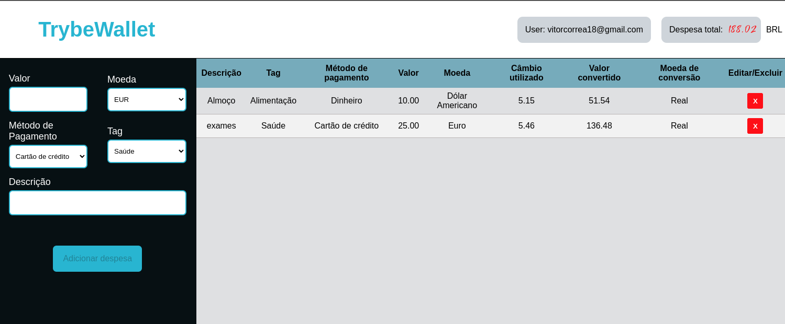

# Trybewallet

This project was developed during the web development course at [Trybe](https://www.betrybe.com/). <br>
The project is a front end application designed to be a expense controller. You can enter expenses in many diferent currencies and the App will <br>
make the convertion to Brazilian Real based on the currency price at the moment.



## API used
> https://docs.awesomeapi.com.br/api-de-moedas

## Installation

Clone this repository
```bash
git clone git@github.com:VitorCorrea18/project-trybewallet.git
```
In the project's folder install the dependencies
```bash
npm install
```
Start the project
```bash
npm start
```

<b>Now it should be running on your default browser</b>

## Usage

* Login screen <br>
You must enter a valid email like 'test@exemple.com' and any password with 6 or more charecters

* Wallet <br>
The left side you will see a form to enter your expenses. Here you enter your expense:

> - Valor: Value
> - Moeda: Currency
> - Método de pagamento: Payment method, choose from credit, debit, or cash
> - Tag: choose from 'Alimentação', 'Lazer', 'Transporte' and 'Saúde' (Food, Leisure or Entertainment, Transport and Health respectively)
> - Descrição: Description

<b>Click on 'Adicionar Despesa' button to save</b>
<br>

* The espense shows the information you entered plus <b>Câmbio Utilizado, Valor Convertido and Moeda de conversão</b> <br> 
meaning <b>'Used Currency','Converted Value' and 'Convertion Currency'</b> respectively. The Convertion Currency will always be Brazilian Real

* You can delete an expense by clicking on the red square icon with an X
* You can see the total of all the expenses at the top right side of the screen in red.
  

## Obervations
  The project could not be completed 100% in the time given, as there were much more to study and projects to be carried out,
  so some features were never implemented. With time maybe i can go back to review this and add the Edit button to chage an expense, 
  so for now you can only delete it. <br> <br>
  <b>Feedbacks are welcome :rocket:</b>
